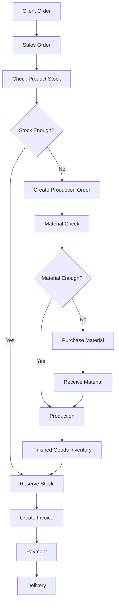
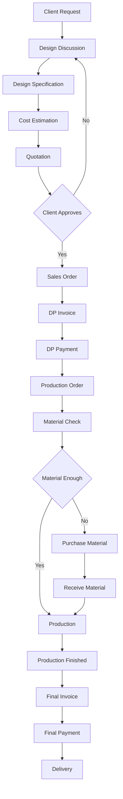

# Product Requirement Document (PRD)

## Furniture Production Management System

## 1. Overview

Sistem ini adalah aplikasi untuk membantu usaha **produksi mebel** mengelola seluruh proses bisnis mulai dari:

- permintaan client
- desain produk
- estimasi biaya
- produksi
- manajemen material
- penjualan
- invoice dan pembayaran
- pengiriman

Sistem harus mendukung dua jenis produk:

1. **Produk Tetap (Stock Product / Make-to-Stock)**
2. **Produk Kustom (Make-to-Order)**

Tujuan utama sistem:

- melacak penggunaan material
- menghitung biaya produksi
- mengelola stok produk
- mencatat penjualan dan invoice
- mengetahui profit per order / batch produksi

---

# 2. Goals

### Business Goals

- Mengurangi kesalahan pencatatan material
- Mempermudah pelacakan produksi
- Menghitung profit per order
- Mengetahui stok material dan produk

### Product Goals

- Sistem produksi yang sederhana namun fleksibel
- Mendukung produk stok dan produk kustom
- Integrasi antara produksi, inventory, dan sales

---

# 3. Target Users

### 1. Owner

Melihat laporan bisnis dan profit.

### 2. Admin

Mengelola order, invoice, dan pembayaran.

### 3. Production Manager

Mengelola proses produksi.

### 4. Warehouse Staff

Mengelola stok material dan produk.

---

# 4. Product Types

## 4.1 Produk Tetap

Karakteristik:

- desain tetap
- BOM tetap
- bisa diproduksi batch
- bisa memiliki stok

Contoh:

- kursi cafe
- meja makan
- lemari standar

Produksi dapat dipicu oleh:

- **production planning**
- **sales order**

---

## 4.2 Produk Custom

Karakteristik:

- desain berdasarkan permintaan client
- produksi setelah deal
- biasanya satuan
- tidak disimpan sebagai stok

Contoh:

- lemari custom
- meja ukuran khusus
- furniture desain client

---

# 5. Core Features

## 5.1 Client Request Management

Mencatat permintaan awal dari client.

Data:

- client name
- contact
- request description
- design notes

---

## 5.2 Design Management

Menyimpan spesifikasi desain.

Data:

- ukuran
- material
- gambar desain
- catatan revisi

---

## 5.3 Cost Estimation

Menghitung estimasi biaya produksi.

Komponen biaya:

- material
- tenaga kerja
- overhead produksi

Output:

- estimated cost
- suggested price

---

## 5.4 Quotation

Penawaran harga kepada client.

Data:

- produk
- qty
- harga
- valid until

Status:

- draft
- sent
- approved
- rejected

---

## 5.5 Sales Order

Order resmi dari client.

Data:

- client
- product
- quantity
- order type (stock/custom)
- price
- order status

---

# 6. Production Management

## 6.1 Production Order

Mencatat pekerjaan produksi.

Data:

- product
- quantity
- related sales order
- status

Status:

```
planned
in_progress
finished
```

---

## 6.2 Production Batch

Digunakan untuk produksi produk tetap.

Data:

- product
- quantity produced
- total cost
- cost per unit

---

## 6.3 Production Process

Tahapan produksi:

```
cutting
assembly
finishing
```

---

# 7. Material Management

## 7.1 Materials

Data material:

- name
- unit
- cost

---

## 7.2 Purchase Material

Pembelian material dari supplier.

Data:

- supplier
- material
- quantity
- cost

---

## 7.3 Material Inventory

Stok bahan baku.

Stock dihitung dari:

```
purchase - production usage
```

---

# 8. Finished Goods Inventory

Menyimpan stok produk jadi.

Digunakan untuk:

- produk tetap
- sisa produksi batch

Data:

- product
- quantity
- cost per unit

---

# 9. Production Cost

Biaya produksi terdiri dari:

### 1 Material Cost

Kayu, paku, cat, dll.

### 2 Labor Cost

Gaji tukang.

### 3 Overhead Cost

Contoh:

- listrik
- sewa workshop
- maintenance mesin

Overhead dihitung menggunakan:

```
overhead per unit
atau
overhead per month
```

---

# 10. Sales & Invoice

## 10.1 Invoice Produk Tetap

Flow:

```
Sales Order
→ Invoice
→ Payment
→ Delivery
```

---

## 10.2 Invoice Produk Custom

Biasanya menggunakan:

```
Invoice DP
Invoice Pelunasan
```

Flow:

```
Quotation
→ Sales Order
→ DP Invoice
→ Production
→ Final Invoice
→ Delivery
```

---

# 11. Payment Management

Mencatat pembayaran client.

Data:

- invoice
- payment amount
- payment date
- payment method

Status:

```
unpaid
partial
paid
```

---

# 12. Delivery Management

Mengelola pengiriman produk.

Data:

- delivery date
- delivery address
- delivery status

---

# 13. Profit Calculation

Profit dihitung dari:

```
profit = sales price - production cost
```

Production cost berasal dari:

```
material + labor + overhead
```

---

# 14. Key Workflows

## Produk Tetap



---

## Produk Custom



---

# 15. Key Metrics

Sistem harus bisa menampilkan:

- total sales
- total production cost
- profit per order
- profit per product
- material usage
- inventory levels

---

# 16. Future Features (Optional)

Fitur lanjutan:

- cutting optimization untuk kayu
- worker time tracking
- production scheduling
- supplier management
- purchase forecasting

---

Kalau PRD ini kamu pakai untuk **AI coding (misalnya dengan Cursor / Copilot / AI agent)**, sebenarnya ada satu dokumen tambahan yang sangat membantu:

**AI Context Document**.

Isinya:

- struktur database
- aturan bisnis
- naming convention
- API design

Tanpa dokumen itu, AI biasanya tetap coding… tapi logika produksinya bisa tiba-tiba memproduksi **kursi dari udara kosong**. Developer manusia juga kadang begitu, jadi jangan terlalu keras menilai mesin.
